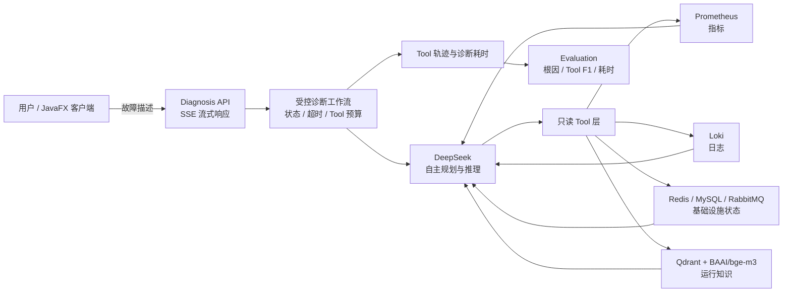

# RootSight

> 一个面向通用软件系统的智能运维故障诊断 Agent：让大模型在受控、只读、可追踪的边界内，自主完成取证、推理和诊断报告生成。

我做 RootSight 的目标，不是简单地把大模型接到一个聊天框，而是验证一条更完整的 AIOps 路径：当系统出现延迟升高、缓存不可用、消息积压或数据库异常时，Agent 能否根据问题自主选择观测工具，读取真实证据，停止无效调用，并给出可以追溯依据的结论。

RootSight 当前已经打通指标、日志、中间件状态、运行知识和诊断评测。整个项目只执行观察与分析，不重启服务、不修改配置、不消费消息，也不执行模型生成的 SQL。

## 项目亮点

- **不是固定脚本，而是自主取证 Agent**：没有把“某类故障对应某组 Tool”写死在提示词中。模型根据问题和已有证据决定调用哪些 Tool、调用顺序以及何时结束取证。
- **接入真实可观测数据**：通过 Prometheus 查询 HTTP/JVM 指标，通过 Loki 查询应用日志，并直接检查 Redis、MySQL、RabbitMQ 的运行状态。
- **从文档中补充系统上下文**：使用硅基流动 `BAAI/bge-m3` 生成 Embedding，将 README、Runbook 和运维文档写入本地 Qdrant，为诊断提供 RAG 运行知识。
- **诊断过程受到工程约束**：每次请求都有独立状态、总超时和 Tool 调用预算；预算在访问外部服务前原子预占，避免模型重复调用形成无界循环。
- **证据可区分、过程可追踪**：实时证据、运行知识和演示证据具有明确标识；SSE 终止事件保留 Tool 调用轨迹、工作流状态和诊断耗时。
- **内置 Evaluation**：可以批量运行故障场景，统计根因定位准确率、Tool Precision/Recall/F1、诊断耗时和场景通过率，而不是只凭主观感受评价 Agent。
- **故障时仍可诊断**：Redis、MySQL、RabbitMQ、Qdrant 或 Embedding 不可用时会降级为安全证据，不会把被观察目标的故障误判成 RootSight 自身故障。
- **同时提供 REST API 与桌面端**：后端以 SSE 增量输出，JavaFX 客户端同步展示诊断正文、状态和 Tool 轨迹。

## 系统架构



一次诊断会经历以下过程：

1. `PLANNING`：理解故障现象，确定需要验证的方向。
2. `EVIDENCE_COLLECTION`：模型按需调用只读 Tool，每次调用前占用一个预算名额。
3. `SYNTHESIS`：证据充分后停止调用 Tool，整理事实、推断和待验证项。
4. `COMPLETED`、`FAILED`、`TIMED_OUT` 或 `TOOL_LIMIT_REACHED`：返回终态、耗时和完整 Tool 轨迹。

更完整的设计说明见 [架构设计](docs/architecture.md)。

## 已接入的诊断能力

| 能力 | 数据来源 | 主要用途 | 安全边界 |
| --- | --- | --- | --- |
| HTTP/JVM 指标 | Prometheus | 抓取状态、QPS、5xx、成功率、P95/P99、CPU、堆内存、线程数 | 模型不能提交 PromQL |
| 应用日志 | Alloy + Loki | 异常检索、故障时间锚点、自适应扩窗、上下文补查 | 模型不能提交 LogQL，日志进入模型前脱敏和截断 |
| Redis 状态 | Redis `PING/INFO` | 连通性、内存、连接、命中率等状态 | 不扫描 Key，不执行写命令 |
| MySQL 状态 | JDBC 固定查询 | 实例版本、运行时间、连接、慢查询等状态 | 只读连接池，不接受模型 SQL |
| RabbitMQ 状态 | Management API | 节点概览、队列积压、消费者数量 | 不建立 AMQP 连接，不读写消息 |
| 安全配置摘要 | 固定白名单 | 帮助模型理解目标和可用能力 | 排除密码、密钥、用户名、URL 和原始环境变量 |
| 运行知识 | Qdrant + Embedding | 检索架构说明、Runbook 和故障经验 | 文档知识不冒充实时状态，按系统隔离检索 |

## 技术栈

- Java 17、Spring Boot 4.1.0、Spring AI 2.0.0
- DeepSeek `deepseek-v4-flash`
- 硅基流动 `BAAI/bge-m3` Embedding
- Qdrant、Prometheus、Grafana Loki、Grafana Alloy
- Redis、MySQL、RabbitMQ Management API
- Reactor、SSE、JavaFX 21
- JUnit 5、Mockito、MockMvc

## 快速开始

### 1. 环境要求

- JDK 17
- Docker Desktop / Docker Compose
- 可用的 DeepSeek API Key
- 可用的硅基流动 API Key
- 可选：Redis、MySQL、RabbitMQ 的只读监控账号

项目自带 Maven Wrapper，不需要单独安装 Maven。

### 2. 配置密钥

PowerShell：

```powershell
$env:DEEPSEEK_API_KEY="your-deepseek-api-key"
$env:SILICONFLOW_API_KEY="your-siliconflow-api-key"
```

密钥只从环境变量读取，不应写入 `application.yml`、`.env.example` 或 Git 历史。

### 3. 启动本地观测与向量基础设施

```powershell
Copy-Item observability/.env.example observability/.env
# 按实际目标修改 observability/.env 中的日志目录和 service_name

docker compose --env-file observability/.env `
  -f observability/docker-compose.yml up -d
```

该 Compose 会启动 Loki、Alloy、Prometheus 和 Qdrant。Redis、MySQL、RabbitMQ 属于被观察目标，不由这份 Compose 创建。

### 4. 配置被观察目标

下面是最小示例，实际地址和账号按环境覆盖：

```powershell
$env:ROOTSIGHT_TARGET_NAME="order-service-local"

$env:ROOTSIGHT_REDIS_HOST="127.0.0.1"
$env:ROOTSIGHT_REDIS_PORT="6379"
$env:ROOTSIGHT_REDIS_USERNAME="rootsight"
$env:ROOTSIGHT_REDIS_PASSWORD="your-readonly-password"

$env:ROOTSIGHT_DB_URL="jdbc:mysql://127.0.0.1:3306/"
$env:ROOTSIGHT_DB_USERNAME="readonly"
$env:ROOTSIGHT_DB_PASSWORD="your-readonly-password"

$env:ROOTSIGHT_RABBITMQ_MANAGEMENT_URL="http://127.0.0.1:15672"
$env:ROOTSIGHT_RABBITMQ_USERNAME="rootsight_monitor"
$env:ROOTSIGHT_RABBITMQ_PASSWORD="your-monitoring-password"
```

完整接入方式、Prometheus 目标文件和知识源配置见 [部署与接入](docs/deployment.md)。

### 5. 启动 RootSight

```powershell
.\mvnw.cmd spring-boot:run
```

默认端口为 `8081`。确认服务状态：

```powershell
Invoke-RestMethod http://127.0.0.1:8081/actuator/health
```

### 6. 发起流式诊断

```powershell
$body = '{"question":"订单接口延迟明显升高，请结合当前证据定位原因。"}'

curl.exe -N `
  -X POST "http://127.0.0.1:8081/api/diagnoses" `
  -H "Content-Type: application/json; charset=utf-8" `
  --data-raw $body
```

接口会依次返回 `STATUS`、`CONTENT`、`COMPLETED` 或 `ERROR` SSE 事件。最终报告固定包含“诊断结论、关键证据、推理依据、处理建议”，同时返回实际 Tool 轨迹和工作流快照。

### 7. 启动 JavaFX 客户端

```powershell
.\mvnw.cmd javafx:run
```

IDEA 中运行桌面端时，入口类是 `RootSightDesktopLauncher`；Web 后端入口是 `RootSightApplication`。

## Evaluation

Evaluation 默认关闭，避免普通启动意外产生批量模型调用。需要评测时：

```powershell
$env:ROOTSIGHT_EVALUATION_ENABLED="true"
.\mvnw.cmd spring-boot:run
```

另开终端运行示例场景：

```powershell
.\evaluation\run-evaluation.ps1
```

示例覆盖 Redis 不可连接、RabbitMQ 消费者停止和 MySQL 连接异常。报告包含：

- 根因定位准确率
- Tool Precision、Recall 与 F1
- 场景诊断耗时
- 场景通过率和失败明细

评分定义、场景格式和故障准备方式见 [Evaluation 指南](docs/evaluation.md)。

## 项目结构

```text
RootSight
├── src/main/java/.../agent          # 流式诊断、回答格式、轨迹和工作流
├── src/main/java/.../tool           # 真实只读 Tool 与结构化证据
├── src/main/java/.../infrastructure # Redis/MySQL/RabbitMQ/Loki/Prometheus 客户端
├── src/main/java/.../knowledge      # 文档加载、版本化索引和 RAG 检索
├── src/main/java/.../evaluation     # 场景执行、评分和报告聚合
├── src/main/java/.../desktop        # JavaFX 桌面客户端
├── observability                    # Loki、Alloy、Prometheus、Qdrant Compose
├── evaluation                       # 示例场景与运行脚本
└── docs                             # 架构、部署和评测文档
```

## 测试

```powershell
.\mvnw.cmd test
```

当前回归覆盖诊断工作流、SSE API、Tool 轨迹隔离、基础设施安全失败、日志与指标查询、RAG 索引降级、Evaluation 评分和桌面资源加载。Stage 7 完成时全量结果为 **53 tests，0 failures，0 errors**。

## 设计边界

RootSight 当前定位在 AIOps 的 **Observe + Reason** 阶段：

- 可以读取证据、判断根因、指出证据缺口并给出处置建议。
- 不会自动重启服务、修改配置、执行写 SQL、写 Redis、发布或消费消息。
- 不保存跨请求会话记忆，也不提供持久化 Checkpoint。
- Evaluation 报告由调用方保存，暂未提供历史趋势看板。
- 当前一个 RootSight 实例连接一组逻辑目标，多目标动态切换仍属于后续演进方向。

这些限制是有意保留的安全边界。相比直接增加自动执行能力，我更关注诊断证据是否真实、Tool 是否选对、推理是否可追溯，以及目标故障时 Agent 自身能否继续工作。

## 文档

- [架构设计](docs/architecture.md)
- [部署与目标接入](docs/deployment.md)
- [Evaluation 指南](docs/evaluation.md)
- [开发与调试](docs/development.md)
- [日志目录说明](observed-logs/README.md)

## 阶段完成情况

| 阶段 | 内容 | 状态 |
| --- | --- | --- |
| Stage 1 | DeepSeek、诊断 API、Tool Calling、JavaFX | 已完成 |
| Stage 2 | Redis、MySQL、RabbitMQ 与安全配置 Tool | 已完成 |
| Stage 3 | Alloy 日志采集与 Loki 自适应查询 | 已完成 |
| Stage 4 | Prometheus 指标采集与固定 PromQL | 已完成 |
| Stage 5 | BAAI/bge-m3、Qdrant 与版本化 RAG | 已完成 |
| Stage 6 | 请求级状态机、总超时和原子 Tool 预算 | 已完成 |
| Stage 7 | 故障场景、Evaluation 评分与报告 | 已完成 |
