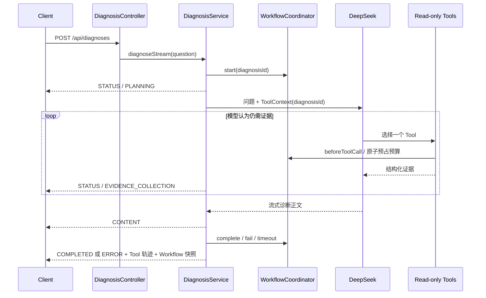

# RootSight 架构设计

本文记录 RootSight 当前已经实现的运行链路、模块职责和安全设计。项目核心不是让模型“知道更多”，而是让模型只能在明确的证据入口和资源边界内完成诊断。

## 1. 设计目标

RootSight 围绕四个目标构建：

1. **自主性**：模型根据故障现象自主选择 Tool，不依赖故障类型到调用顺序的硬编码映射。
2. **真实性**：诊断优先使用实时指标、日志和基础设施状态；文档知识不得冒充当前运行状态。
3. **可控性**：单次诊断有独立状态、总超时和 Tool 预算，所有外部查询都受参数白名单和结果上限约束。
4. **可评估性**：保留 Tool 轨迹、工作流终态和耗时，并通过 Evaluation 量化根因和 Tool 选择质量。

## 2. 模块职责

| 模块 | 主要职责 |
| --- | --- |
| `api` | 接收诊断和评测请求，返回 SSE 或 Evaluation 报告 |
| `agent` | 调用模型、格式化流式正文、管理 Tool 轨迹和诊断状态 |
| `tool` | 向模型暴露有界、只读、结构化的诊断能力 |
| `infrastructure` | 封装 Redis、MySQL、RabbitMQ、Loki 和 Prometheus 的真实访问 |
| `knowledge` | 加载 Markdown、版本化分块、写入 Qdrant 并执行受控检索 |
| `evaluation` | 顺序运行故障场景，计算根因、Tool F1、耗时和通过率 |
| `desktop` | JavaFX 客户端、SSE 订阅和增量渲染 |

## 3. 诊断运行链路

`ToolContext` 中只传递内部诊断 ID。Tool 通过该 ID 找到对应轨迹和工作流，不依赖 `ThreadLocal`，因此 Reactor 线程切换或并发请求不会串线。

## 4. 受控工作流

### 状态

- `PLANNING`：模型理解问题并规划证据。
- `EVIDENCE_COLLECTION`：至少一个真实 Tool 已开始执行。
- `SYNTHESIS`：模型停止取证并开始输出结论。
- `COMPLETED`：正常完成。
- `FAILED`：模型或诊断链路失败。
- `TIMED_OUT`：超过单次诊断总时限。
- `TOOL_LIMIT_REACHED`：模型试图超过 Tool 预算。

### Tool 预算

默认单次诊断最多执行 8 次 Tool。预算在真正访问 Redis、MySQL、RabbitMQ、Loki、Prometheus 或 Qdrant 之前原子预占，而不是调用结束后计数。这保证并发或连续调用无法越过上限后再访问外部系统。

### 总超时

默认 90 秒覆盖模型规划、所有 Tool 取证和最终报告生成。各基础设施客户端仍保留更短的连接与读取超时，避免一个数据源耗尽整次诊断预算。

## 5. Tool 与证据设计

Tool 不返回自由格式异常堆栈，而是返回结构化证据。连接失败会转换成安全状态，例如 `DOWN` 或 `UNAVAILABLE`，底层 URL、凭证和异常正文不会进入模型上下文。

### 实时证据

- Prometheus：固定生成 PromQL，模型只能选择目标服务、故障时间和白名单窗口。
- Loki：后端构造 LogQL，模型只能提供服务、时间、关键词、traceId 和数量。
- Redis：只执行 `PING` 和分区 `INFO`。
- MySQL：只执行源码中固定的状态查询。
- RabbitMQ：只读取 Management API 的节点与队列摘要。

### 运行知识

RAG 返回 `OPERATIONAL_KNOWLEDGE`，并明确 `realtimeEvidence=false`。系统提示要求模型将其视为待核对资料，而不是当前状态或可执行指令。

### 证据来源

- `REAL`：来自当前配置的数据源。
- `DEMO`：固定演示数据，只保留用于回归早期 Agent Loop。
- `OPERATIONAL_KNOWLEDGE`：设计文档、Runbook 或历史经验。

## 6. RAG 索引设计

运行知识默认读取知识根目录中的：

- `README.md`
- `docs/*.md`
- `runbooks/*.md`

面试题和 question bank 默认排除。索引流程包含以下保护：

1. 解析后的文件必须仍位于知识根目录内，越界路径和外部符号链接不会被读取。
2. 文件数、文件大小、分块长度、单文件分块数、查询长度、Top K 和返回片段长度均有上限。
3. 文档完整内容使用 SHA-256 形成版本，新版本全部写入成功后才清理旧版本。
4. 分块使用确定性 UUID，重复启动不会无限产生副本。
5. 检索按 `system_name` 过滤，避免多个目标的知识混用。
6. Qdrant 或 Embedding 故障只降低 RAG 能力，不阻止 RootSight 启动和使用其他 Tool。

## 7. 可观测性链路

### 日志

目标应用输出文件日志，Alloy 只读采集并写入 Loki。Loki Tool 支持：

- 以故障时间为锚点查询前后窗口。
- 无结果时从 30 分钟扩展到 2 小时、6 小时和 24 小时。
- 最多回溯 7 天查找最近异常。
- 命中 ERROR/WARN 后补查短窗口上下文。
- 对密码、API Key、Authorization、Token 和 Bearer Token 脱敏。

### 指标

Prometheus 通过 `file_sd` 加载目标，不要求修改 RootSight Java 代码。Tool 查询抓取状态、HTTP 指标和 JVM 指标，并区分：

- `UP`：目标可抓取且核心 HTTP 指标存在。
- `DOWN`：`up=0`。
- `DEGRADED`：可抓取但缺少核心指标。
- `NO_DATA`：没有对应时间序列。
- `UNAVAILABLE`：Prometheus 自身不可访问。

## 8. 降级与健康边界

Redis、MySQL 和 RabbitMQ 是被观察目标，不是 RootSight 自身启动依赖。Spring Boot 的 Redis/DB 健康检查被关闭，避免目标宕机时 RootSight 的 `/actuator/health` 同时变为 DOWN。

Qdrant 集合也不会在 VectorStore Bean 初始化阶段强制创建。索引失败由启动同步流程捕获，RootSight 仍可以使用实时 Tool 完成诊断。

## 9. Evaluation

Evaluation 复用真实 `DiagnosisService`，不会为测试更改系统提示词或强制 Tool 顺序。每个场景声明必需 Tool、允许 Tool、根因关键词组、耗时阈值和最低 F1，报告聚合：

- 根因定位准确率
- Tool Precision、Recall 与 F1
- 平均诊断耗时
- 场景通过率

详细规则见 [Evaluation 指南](evaluation.md)。

## 10. 当前边界

项目当前完成 Observe + Reason，不包含 Act：

- 无自动修复和审批流。
- 无跨请求记忆和持久化 Checkpoint。
- 无多租户、多目标动态路由。
- 无 Evaluation 历史数据库和趋势看板。

这些边界使当前实现可以集中验证“证据是否真实、调用是否安全、根因是否准确”。
